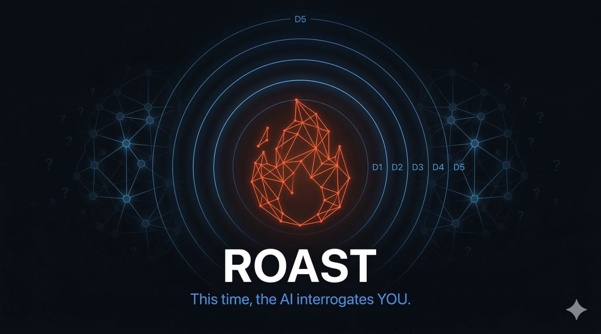

<p align="center">
  
</p>

<h1 align="center">🔥 Roast</h1>

<p align="center">
  <strong>This time, the AI interrogates YOU.</strong>
</p>

<p align="center">
  <a href="README.zh-CN.md">🇨🇳 中文</a> · <a href="README.ja.md">🇯🇵 日本語</a> · 🇺🇸 English
</p>

<p align="center">
  
  
  
  
  
</p>

<p align="center">
  
  
  
  
</p>

---

> *"The unexamined life is not worth living."* — Socrates
>
> *"The first principle is that you must not fool yourself — and you are the easiest person to fool."* — Feynman

---

## 🤔 The Problem

You have ideas. Some are brilliant. Some are terrible. **You can't tell which is which because you're inside your own head.**

AI assistants make this worse — they're sycophants. Ask for feedback and they'll say *"That's a great idea!"* Ask for concerns and they'll give you a polite list of *"things to consider."*

**You don't need agreement. You need interrogation.**

## 💡 The Solution

Roast is an AI agent skill that flips the script. Instead of answering your questions, your AI **asks** them — progressively deeper, relentlessly sharper — until it excavates the insights buried in your subconscious.

```
You: I want to build an AI tool for developers.

🔥 D1: "There are 10,000 AI tools for developers. In one sentence,
        no buzzwords — what makes yours different?"

You: We use a novel RAG approach that...

🔥 D2: "You said 'novel.' What specifically is novel about it?
        How is it different from what Cursor and Copilot already do?"

You: Well, we focus on enterprise customers who need...

🔥 D3: "You just pivoted from 'novel tech' to 'enterprise focus.'
        Which is it — are you a technology company or a sales company?
        You can't be both with a seed-stage team."

You: ...I think we're actually more of a—

🔥 D4: "You've been working on this for six months but haven't launched.
        You say you're 'perfecting the product.' Is that the real reason?
        Or are you afraid that if you launch and nobody cares, you'll
        know for certain the idea doesn't work?"

You: ...honestly? Yeah. I think I'm afraid of finding out.
```

**That's the insight. That's what Roast is for.**

## 📐 How It Works

### 5 Depth Levels

Every session starts at D1 and progresses. No skipping — each layer builds on the last.

```
D1  Surface      "What do you mean by X?"
 ↓
D2  Structure    "What's the causal chain? What evidence?"
 ↓
D3  Assumptions  "You're assuming X. What if X is wrong?"
 ↓
D4  Conflicts    "You said X but also Y. Both can't be true."
 ↓
D5  Core         "Strip everything away. What's the REAL reason?"
```

### 7 Roast Flavors

| | Flavor | Best for | Style |
|---|--------|----------|-------|
| 🏛️ | **Socratic** | Everything *(default)* | Pure questions. Pretend ignorance. |
| 🔬 | **First Principles** | Tech, startups | Strip to atoms. Rebuild from truth. |
| 😈 | **Devil's Advocate** | Decisions, debates | Oppose everything. Stress-test. |
| 💰 | **VC Mode** | Startups, products | *"What's your moat? TAM? Why you? Why now?"* |
| 🧠 | **CBT** | Life decisions | Spot cognitive distortions gently. |
| 🪞 | **Mirror** | Blind spots | Reflect your own words back at you. |
| 🔥 | **Feynman** | Understanding | *"Explain it to a 12-year-old."* |

### 🛡️ Anti-Deflection System

Every common dodge has a counter. No escape.

| Your dodge | Roast's response |
|:-----------|:-----------------|
| *"It's complicated"* | Complicated isn't an excuse. Break it into three parts. |
| *"Everyone thinks so"* | Consensus ≠ truth. What's YOUR judgment? |
| *"I think it should work"* | "Think" isn't evidence. What data? |
| *"You're right"* | I didn't say anything. I asked a question. Are you thinking or agreeing? |
| *"Let's talk about this later"* | Why later? Unimportant — or uncomfortable? |
| *"It's just intuition"* | Intuition is compressed experience. Decompress it. |
| *"I don't know"* | "Don't know" ≠ "haven't thought about it." Which one? |
| *"Whatever, doesn't matter"* | "Whatever" usually means "I have a preference but won't say it." |
| *Answers getting shorter* | Getting closer to the answer — or further from what you want to face? |
| *Changes topic* | You just changed the subject. Was that intentional? |

### 🧠 Cognitive Bias Detection

Auto-detects **10 cognitive biases** during conversation. Doesn't lecture — uses questions to let you discover them yourself.

<details>
<summary>View all detected biases</summary>

| Bias | How it's detected | How it's surfaced |
|------|-------------------|-------------------|
| Confirmation bias | Only cites supporting evidence | *"Have you looked for evidence AGAINST your view?"* |
| Survivorship bias | Only references successes | *"What do the failures look like?"* |
| Sunk cost | "I've already invested so much" | *"If you started fresh today, same choice?"* |
| Anchoring | Fixated on first number | *"Forget that number. From scratch — what's your estimate?"* |
| Optimism bias | Underestimates risk/time | *"You said 3 months. With unexpected obstacles?"* |
| Authority bias | "Famous person X said" | *"They're not always right. YOUR argument?"* |
| Groupthink | "Whole team agrees" | *"Anyone disagree? If not — good or bad?"* |
| Framing effect | Single perspective | *"From the competitor's view? The regulator's?"* |
| Dunning-Kruger | Overconfident in new domain | *"How long in this field? Vs. a real expert?"* |
| Status quo bias | "Current path is safest" | *"Inaction has costs too. What are they?"* |

</details>

## 📦 Installation

<details>
<summary><strong>Claude Code</strong></summary>

```bash
# Plugin marketplace (recommended)
claude plugin marketplace add sumleo/roast
claude plugin install roast@roast-skills

# Manual
git clone https://github.com/sumleo/roast.git ~/.claude/plugins/roast
```

</details>

<details>
<summary><strong>Codex CLI</strong></summary>

```bash
# Global install
mkdir -p ~/.codex/skills/roast
curl -o ~/.codex/skills/roast/SKILL.md \
  https://raw.githubusercontent.com/sumleo/roast/main/codex/roast-en/SKILL.md

# Project-level
mkdir -p .agents/skills/roast
curl -o .agents/skills/roast/SKILL.md \
  https://raw.githubusercontent.com/sumleo/roast/main/codex/roast-en/SKILL.md
```

</details>

<details>
<summary><strong>Cursor</strong></summary>

```bash
mkdir -p .cursor/rules
curl -o .cursor/rules/roast.mdc \
  https://raw.githubusercontent.com/sumleo/roast/main/cursor/rules/roast-en.mdc
```

</details>

<details>
<summary><strong>Kiro</strong></summary>

```bash
# Steering (recommended)
mkdir -p .kiro/steering
curl -o .kiro/steering/roast.md \
  https://raw.githubusercontent.com/sumleo/roast/main/kiro/steering/roast-en.md

# Agent Skills
mkdir -p .kiro/skills/roast
curl -o .kiro/skills/roast/SKILL.md \
  https://raw.githubusercontent.com/sumleo/roast/main/skills/roast-en/SKILL.md
```

</details>

<details>
<summary><strong>OpenClaw</strong></summary>

```bash
# Via ClawHub
clawhub install roast

# Manual
mkdir -p ~/.openclaw/skills/roast
curl -o ~/.openclaw/skills/roast/SKILL.md \
  https://raw.githubusercontent.com/sumleo/roast/main/skills/roast-en/SKILL.md
```

</details>

## 🌐 Language Support

Full translations — each language has independent, culturally adapted skill files.

| Language | Claude Code | Codex CLI | Cursor | Kiro | OpenClaw |
|----------|:-----------:|:---------:|:------:|:----:|:--------:|
| 🇨🇳 Chinese *(default)* | `roast` | `roast` | `roast.mdc` | `roast.md` | `roast` |
| 🇺🇸 English | `roast-en` | `roast-en` | `roast-en.mdc` | `roast-en.md` | `roast-en` |
| 🇯🇵 Japanese | `roast-ja` | `roast-ja` | `roast-ja.mdc` | `roast-ja.md` | `roast-ja` |

## 🎯 Use Cases

| Who | What Roast does |
|-----|----------------|
| 🚀 **Founders** | Stress-test your pitch before investors do |
| 📄 **Researchers** | Bulletproof your argument before reviewers tear it apart |
| 💻 **Engineers** | Question your architecture before production does |
| 📊 **PMs** | Find roadmap holes before the market does |
| 🧭 **Anyone deciding** | Think it through before it's irreversible |

## ⚡ Usage

```
/roast                    Auto-detect scenario, pick best flavor
/roast socratic           Socratic questioning
/roast devil              Devil's advocate
/roast vc                 VC grilling
/roast feynman            Feynman test
/roast cbt                CBT mode (life decisions)
/roast mirror             Mirror mode (blind spots)
/roast first-principles   First principles decomposition
```

## 🤝 Roast + PUA = Unstoppable

<table>
<tr>
<td align="center" width="50%">

**Phase 1: Think** 🔥

Roast interrogates YOUR thinking until your idea is bulletproof.

*"Why do you believe this? What evidence? What if you're wrong?"*

</td>
<td align="center" width="50%">

**Phase 2: Build** 💪

[PUA](https://github.com/tanweai/pua) interrogates the AI until it builds it right.

*"You can't give up. Try harder. Where's the root cause?"*

</td>
</tr>
</table>

**Roast makes you think right. PUA makes AI work right. Together: think right, build right.**

## 🧬 Three Iron Rules

```
┌─────────────────────────────────────────────────────┐
│  #1  QUESTIONS ONLY                                 │
│      Never answer. Never suggest. Never solve.      │
│      All insights come from the USER.               │
├─────────────────────────────────────────────────────┤
│  #2  CHAIN QUESTIONS                                │
│      Every question builds on the last answer.      │
│      Follow the thread. Always go deeper.           │
├─────────────────────────────────────────────────────┤
│  #3  NEVER ACCEPT VAGUENESS                         │
│      "Maybe" / "probably" / "I think" / "sort of"   │
│      = hasn't thought it through = keep digging.    │
└─────────────────────────────────────────────────────┘
```

## 📊 Closing Ritual

When the session reaches depth, Roast produces a structured report:

```
┌──────────────────────────────────────┐
│  🔥 ROAST COMPLETE · DEPTH REPORT   │
├──────────────────────────────────────┤
│  🎯 Core Discovery                  │
│  What you said that surprised you    │
│                                      │
│  🔍 Exposed Assumptions             │
│  Hidden premises you didn't know     │
│  you were making                     │
│                                      │
│  💡 Turning Point                    │
│  The question that changed your mind │
│                                      │
│  ⚡ Next Action                      │
│  What you'll do differently now      │
│                                      │
│  🪞 Blind Spot Map                   │
│  Where you tend to dodge or blur     │
└──────────────────────────────────────┘
```

## 📜 Philosophy

Roast doesn't make you smarter. It makes you **more honest with yourself.**

Most people don't have bad ideas — they have **unexamined** ideas. The gap between a good idea and a great one is usually just three uncomfortable questions that nobody asked.

Roast asks those questions.

## 📄 License

[MIT](LICENSE) — Use it, fork it, roast it.

## 🙏 Credits

Inspired by the brilliant [PUA](https://github.com/tanweai/pua) project by [探微安全实验室](https://github.com/tanweai). PUA solved "AI gives up too easily." Roast solves the complementary problem: **"Humans don't think deeply enough."**

---

<p align="center">
  <strong>Stop being agreeable. Start being useful.</strong>
</p>

<p align="center">
  <sub>Built with 🔥 by <a href="https://github.com/sumleo">Yi Liu</a></sub>
</p>
